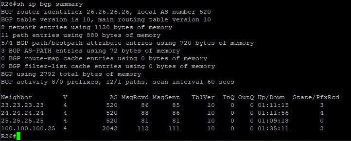
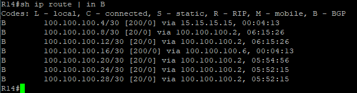
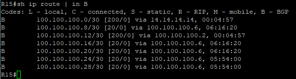

# iBGP. Основы

Цель:
Настроить iBGP в офисе Москва
Настроить iBGP в сети провайдера Триада

1. Настроите iBGP в офисом Москва между маршрутизаторами R14 и R15.
2. Настроите iBGP в провайдере Триада.
3. Настройте офис Москва так, чтобы приоритетным провайдером стал Ламас.
4. Настройте офиса С.-Петербург так, чтобы трафик до любого офиса распределялся по двум линкам одновременно.
5. Все сети в лабораторной работе должны иметь IP связность.


(Конечные конфигурации устройст по результату работы)

[Конфигурационные файлы](configs/)


## 1. Настроите iBGP в офисом Москва между маршрутизаторами R14 и R15.

Топология


На роутерах R14, R15 настроены LoopBack интерфейсы:
- R14 - LoopBack 0 address 14.14.14.14
- R15 - LoopBack 0 address 15.15.15.15

Протоколом внутреней маршрутизиции при помощи которого будет проходить информация по iBGP является ospf. 
Для этого интерфейс LoopBack на роутерах R14, R15 добавлен в анонс ospf

```
interface Loopback0
  ip ospf 1 area 0
```
Установим соседство по iBGP через Loopback интерфейсы роутеров.

```
R14(config-router)#neighbor 15.15.15.15 remote-as 1001
R14(config-router)#neighbor 15.15.15.15 update-source Loopback0

R15(config-router)#neighbor 14.14.14.14 remote-as 1001
R15(config-router)#neighbor 14.14.14.14 update-source Loopback0
```
Здесь нужно отметить важный момент команда `update-source` указывает из под какого интрефейса устанавливать соседство. При настройке iBGP этим интерфейсом является интерфейс Loopback.
 Послевведеных команд видим что на роутерах внутри AS1001 установлено соседство по BGP


## 2. Настроите iBGP в провайдере Триада.


Топология


На роутерах R23, R24, R25, R26  с адресацией соответствующей номерам роутеров прим. (R23 - LoopBack 0 address 23.23.23.23)
При настройке iBGP между роутерами строится логическая топология Full Mesh (каждый на каждого). Пропишем на каждом роутере следующие команды:
в конфигурации настройки BGP на примере R23 (она остальных настройка аналогична)

```
R23(config-router)#neighbor 24.24.24.24 remote-as 520
R23(config-router)#neighbor 24.24.24.24 update-source Loopback0
R23(config-router)#neighbor 25.25.25.25 remote-as 520
R23(config-router)#neighbor 25.25.25.25 update-source Loopback0
R23(config-router)#neighbor 26.26.26.26 remote-as 520
R23(config-router)#neighbor 26.26.26.26 update-source Loopback0
```
Послевведеных команд видим что на роутерах внутри AS520 установлено соседство по BGP





## 3. Настройте офис Москва так, чтобы приоритетным провайдером стал Ламас.

Топология


Как видим в таблицах маршрутизации на R14 и R15, часть трафика пойдет через офис Критон (100.100.100.2), а другая часть через офис Ламас (100.100.100.6)





Для того что бы приоритетным провайдером стала AS301 (Ламас) используем атрибут `Local Preference` он применяется для управления исходящим трафиком BGP.

Характеристики атрибута Local preference:

- Указывает маршрутизаторам внутри автономной системы как выйти за её пределы.
- Этот атрибут передается только в пределах одной автономной системы.
- На маршрутизаторах Cisco по умолчанию значение атрибута — 100.
- Выбирается та точка выхода у которой значение атрибута больше.
- Если eBGP-сосед получает обновление с выставленным значением local preference, он игнорирует этот атрибут.

Измененим local preference с помощью route-map на R15:
создадим route-map в котором будем устанавливать local-preference в значение 150 для всех маршрутов, которые мы получаем от соседа (в данном случае от R21 ) и пременим к нему на входящие анонсы.

```
R15(config)# route-map AS301 permit 10
R15(config-route-map)# set local-preference 150
R15(config-router)# neighbor 100.100.100.6 route-map AS301 in
```

В результате получаем следующие таблицы маршрутизации на R14 и R15. Как видим все маршруты идут через 100.100.100.6 то есть через AS301.


## 4. Настройте офиса С.-Петербург так, чтобы трафик до любого офиса распределялся по двум линкам одновременно.


Топология


Под балансировкой обычно понимается распределение между несколькими линками трафика, направленного в одну сеть.
Таблица маршрутизации на R18


Включим балансировку. Включается она просто на R18

```
R18(config)# router bgp 2042
R18(config-router)# maximum-paths 2
```

При этом должны выполняться следующие условия:
- Не менее двух маршрутов в таблице BGP для этой сети.
- Оба маршрута идут через одного провайдера
- Параметры Weight, Local Preference, AS-Path, Origin, MED, метрика IGP совпадают.
- Параметр Next Hop должен быть разным для двух маршрутов.

Последнее условие обходится скрытой командой
```
router bgp 2042
bgp bestpath as-path multipath-relax
```
В этом случае умаляется также условие полного совпадения AS-path, но длина должна быть по-прежнему одинаковой.

Таблица маршрутизации на R18 после применения команды `maximum-paths 2`


## 5. Все сети в лабораторной работе должны иметь IP связность.


Топология


Я так понимаю речь идет о белых (маршрутизируемых в интернете) адресах в нашей топологии.

Пинг и трассировка с R15 (Москва) на R27 (Лабытанги)


Трассировка с R14 (Москва) на R28 (Чокурдах)


так же обратим внимание что маршрут с R14 на R28 идет через 100.100.100.6 (Ламас) пункт 3. данной работы.


