# BGP. Фильтрация

Цель:
Настроить фильтрацию для офисе Москва
Настроить фильтрацию для офисе С.-Петербург


1. Настроить фильтрацию в офисе Москва так, чтобы не появилось транзитного трафика(As-path).
2. Настроить фильтрацию в офисе С.-Петербург так, чтобы не появилось транзитного трафика(Prefix-list).
3. Настроить провайдера Киторн так, чтобы в офис Москва отдавался только маршрут по умолчанию.
4. Настроить провайдера Ламас так, чтобы в офис Москва отдавался только маршрут по умолчанию и префикс офиса С.-Петербург.
5. Все внешние сети в лабораторной работе должны иметь IP связность.


(Конечные конфигурации устройст по результату работы на которых были изменения)

[Конфигурационные файлы](configs/)


Управление маршрутами. Можно выделить следующие инструменты:

- AS-Path ACL
- Prefix-list
- Weight
- Local Preference
- MED

## 1. Настроить фильтрацию в офисе Москва так, чтобы не появилось транзитного трафика(As-path).

Топология

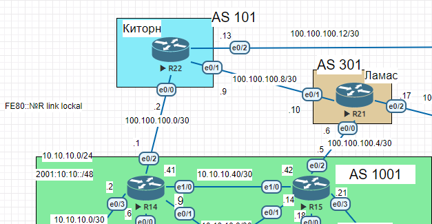

- AS-Path ACL

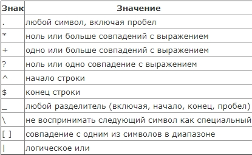

Чтобы проще было понять.

- `_1001_` Маршруты проходящие через `AS 1001`
До и после номера AS идут знаки `“_”`, означающие, что в AS-path номер 1001 может стоять в начале, середине или конце, главное, чтобы он был.
- `^1001$` Маршруты из соседней AS 1001
`“^”` означает начало списка, а `“$”` – конец. То есть в AS-path всего лишь один номер AS – это означает, что маршрут был зарождён в AS 1001 и оттуда сразу был передан нам.
- `_1001$` Маршруты отправленные из AS 1001
`“$”` означает конец списка, то есть это самая первая AS, из неё маршрут и зародился, знак `“_”` говорит о том, что неважно, что находится дальше, хоть ничего, хоть 7 других AS.
- `^1001_` Сети находящиеся за AS 1001
Знак `“^”` означает, что ASN 1001 была добавлена последней, то есть маршрут к нам пришёл из AS 1001, но это не значит, что родился он в ней же – знак `“_”` говорит о том, что это может быть конец списка, а может пробел перед следующей AS.
- `^$` Маршруты локальной AS
Список AS-path пуст, значит маршрут локальный, сгенерированный внутри нашей AS.

Вот последний пример и нужен для настройки фильтрации в офисе Москва AS 1001 так что бы не появлялось транзитного трафика:

Создадим ACL на R15 разрешающий только локальные маршруты, сгенерированные внутри AS 1001 . Так как в прошлой работе по iBGP настраивали что бы приоритетным провайдер был офис Ламас а это выход через R15.

```
R15(config)#ip as-path access-list 1 permit ^$
R15(config)#ip as-path access-list 1 deny .*
```
Применим данный ACL на выход к соседу (офис Ламас)

```
R15(config)#router bgp 1001
R15(config-router)#neighbor 100.100.100.6 filter-list 1 out
```


## 2. Настроить фильтрацию в офисе С.-Петербург так, чтобы не появилось транзитного трафика(Prefix-list).

Топология

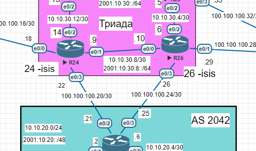


- Prefix-list

Префикс-листы - это уже привычные нам сеть/маска, а мы просто указываем разрешить указанные маршруты или нет.
Синтаксис будет такой:
```
ip prefix-list {list-name} [seq {value}] {deny|permit}
{network/length} [ge {value}] [le {value}]
```

`list-name` - собственно название списка. Оказывается обычно в виде name_in или name_out. Это как бы должно намекать нам на какие маршруты (входящие или исходящие) оно будет действовать.
`seq`- порядковый номер правила, по аналогии с ACL.
`deny/permit` - этот параметр определяет, запрещающее или разрешающее будет правило.
`network/length` - определяем сеть и маску, в нашем случае `10.10.20.0/24`.
Возможны еще два параметра - `ge и le`. Как и при настройке NAT, это логика "greater or equal" и "less or equal".
То есть можно задать и диапазон, а не конкретный префикс

Создаем prefix-list с именем AS2042 разрешающий необходимые нам префексы и вешаем его на соседей:

```
R18(config)#ip prefix-list AS2042 seq 5 permit 10.10.20.0/24
R18(config)#router bgp 2042
R18(config-router)#neighbor 100.100.100.22 prefix-list AS2042 out
R18(config-router)#neighbor 100.100.100.26 prefix-list AS2042 out
```

При помощи команды: `#show ip bgp neighbours A.B.C.D routes` посмотрим акие маршруты были получены от соседа:

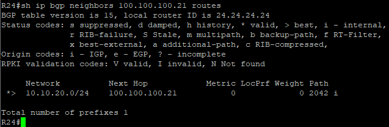

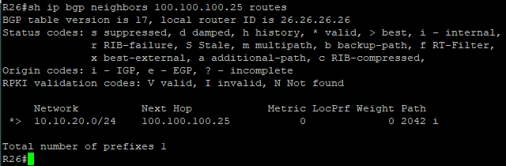

Как видим R18 не отдает транзитные префиксы соседям.


## 3. Настроить провайдера Киторн так, чтобы в офис Москва отдавался только маршрут по умолчанию.

Топология


Посмортим какие маршруты R14 получает от соседа R22

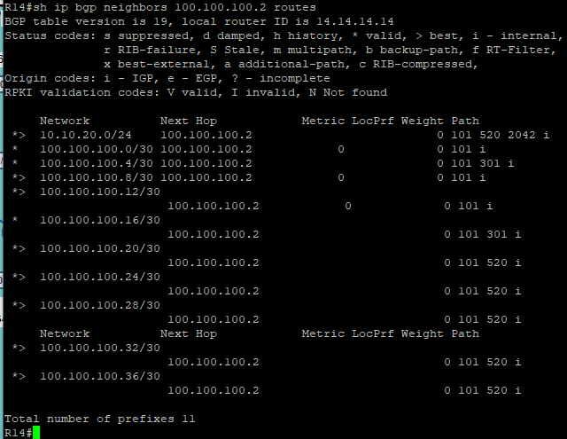


Пропишем что бы R22 отдовал соседу R14 маршрут по умолчанию:
```
R22(config)#router bgp 101
R22(config-router)#neighbor 100.100.100.1 default-originate
```

Создадим prefix-list запрещающий все сети и повесим его на соседа R14:

```
R22(config)#ip prefix-list AS101 deny 0.0.0.0/0
R22(config)#router bgp 101
R22(config-router)#neighbor 100.100.100.1 prefix-list AS101 out
```
Посмортим какие ctqxfc маршруты R14 получает от соседа R22

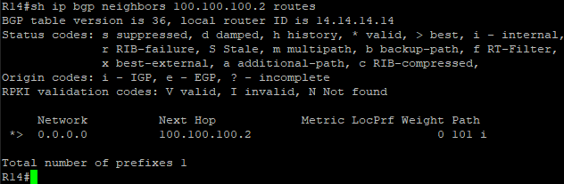

Видим только маршрут по умолчанию.


## 4. Настроить провайдера Ламас так, чтобы в офис Москва отдавался только маршрут по умолчанию и префикс офиса С.-Петербург.

Топология


Маршруты которые получает R15 от R21:

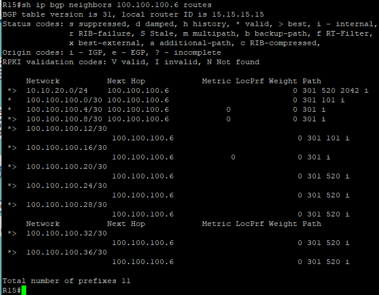

Пропишем что бы R21 отдавал соседу R15 маршрут по умолчанию:

```
R21(config)#router bgp 301
R21(config-router)#neighbor 100.100.100.5 default-originate
```

Создадим prefix-list запрещающий все сети кроме префикса С.-Петербурга и повесим его на соседа R15:


```
R21(config)#ip prefix-list 1 permit 10.10.20.0/24
R21(config)#router bgp 301
R21(config-router)#neighbor 100.100.100.5 prefix-list 1 out
```

Теперь видем следующие маршруты которые получает R15 от R21:

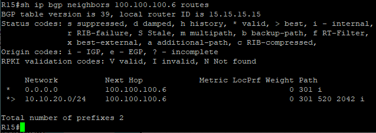

и получили лаконичную таблицу маршрутизации BGP/

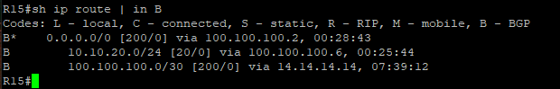


## 5. Все внешние сети в лабораторной работе должны иметь IP связность.

Топология

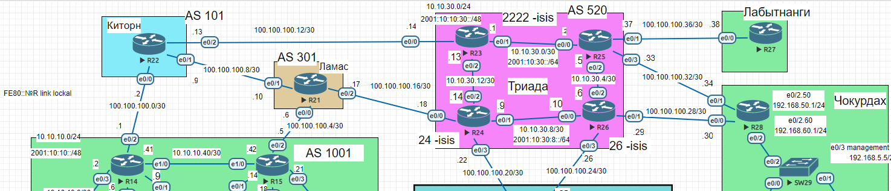


Для примера приводим пинг и трассировку с R14 (Моска) на  R27 (Лабытанги) и на R28 (Чокурдах)


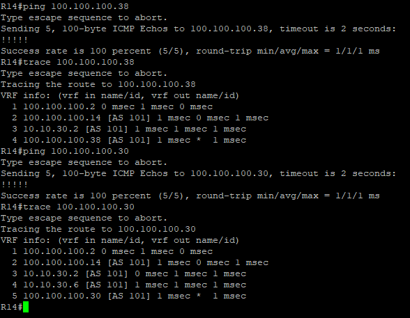


