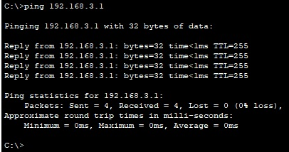
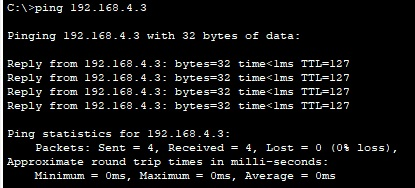
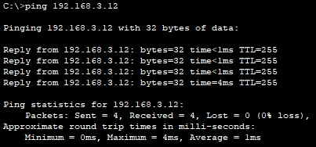
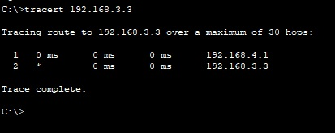

## Configure Router-on-a-Stick Inter-VLAN Routing (Маршрутизация между виртуальными локальными сетями)

В целях повышения производительности сети большие широковещательные домены 2-го уровня 
делят на домены меньшего размера. Для этого современные коммутаторы используют виртуальные 
локальные сети (VLAN). VLAN также можно использовать в качестве меры безопасности, отделяя 
конфиденциальный трафик данных от остальной части сети. Сети VLAN облегчают процесс 
проектирования сети, обеспечивающей помощь в достижении целей организации. Для связи между 
VLAN требуется устройство, работающее на уровне 3 модели OSI. Добавление маршрутизации между 
VLAN позволяет организации разделять и разделять широковещательные домены, одновременно 
позволяя им обмениваться данными друг с другом.

### Топология

### Задачи

* Часть 1. Создание сети и настройка основных параметров устройства
* Часть 2. Создание сетей VLAN и назначение портов коммутатора
* Часть 3. Настройка транка 802.1Q между коммутаторами.
* Часть 4. Настройка маршрутизации между сетями VLAN
* Часть 5. Проверка, что маршрутизация между VLAN работает

### Результат

* a. Ping с PC-A на шлюз по умолчанию

* в. Ping с PC-A на PC-B

* c.  Ping с PC-A на S2

* d. Tracert с PC-B на PC-A

Конфигурации R1, S1, S2 

[здесь](configs/)

