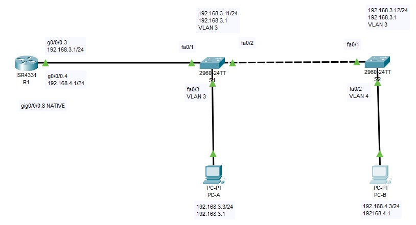

# Configure Router-on-a-Stick Inter-VLAN Routing (Маршрутизация между виртуальными локальными сетями)

В целях повышения производительности сети большие широковещательные домены 2-го уровня 
делят на домены меньшего размера. Для этого современные коммутаторы используют виртуальные 
локальные сети (VLAN). VLAN также можно использовать в качестве меры безопасности, отделяя 
конфиденциальный трафик данных от остальной части сети. Сети VLAN облегчают процесс 
проектирования сети, обеспечивающей помощь в достижении целей организации. Для связи между 
VLAN требуется устройство, работающее на уровне 3 модели OSI. Добавление маршрутизации между 
VLAN позволяет организации разделять и разделять широковещательные домены, одновременно 
позволяя им обмениваться данными друг с другом.

### Топология

