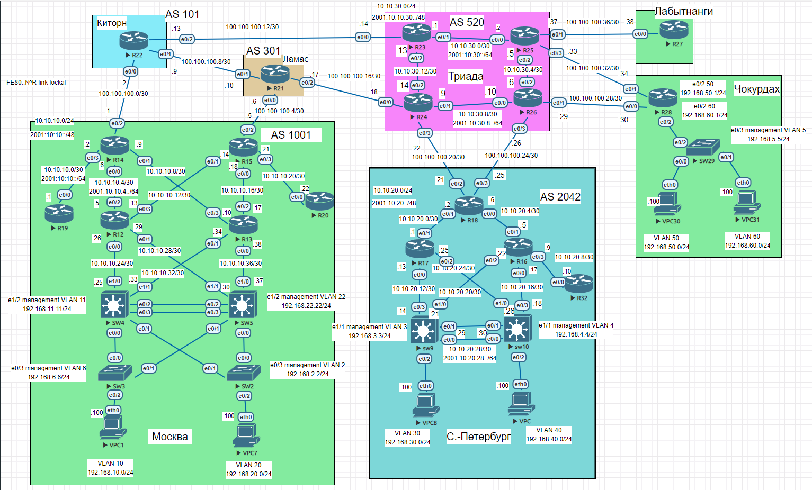

# Архитектура сети

1. Разработаете и задокументируете адресное пространство для лабораторного стенда.
2. Настроите ip адреса на каждом активном порту
3. Настроите каждый VPC в каждом офисе в своем VLAN.
4. Настроите VLAN управления для сетевых устройств
5. Настроите сети офисов так, чтобы не возникало broadcast штормов, а использование линков было максимально оптимизировано
6. Используете ipv4 и ipv6

Базовая топология



Вся ipv4 и ipv6 адресация с сумарными маршрутами сведена в одну таблицу:
там отсутствуют только link-Local адреса для IPv6 они имеют адрес FE80::X для каждого интерфейса где X - номер маршрутизатора/коммутатора представленных на схеме топологии.


|A                 |B     |C                       |D   |E                 |F                     |G                   |H                         |
|------------------|------|------------------------|----|------------------|----------------------|--------------------|--------------------------|
|Deesription office|Typ IP|Summary network         |Host|Port              |Address               |Network             |Description               |
|Москва            |ipv4  |10.10.10.0/24           |R12 |e0/0              |10.10.10.26/30        |10.10.10.24/30      |to e1/0 SW4               |
|                  |      |                        |    |e0/1              |10.10.10.29/30        |10.10.10.28/30      |to e1/1 SW5               |
|                  |      |                        |    |e0/2              |10.10.10.5/30         |10.10.10.4/30       |to e0/0 R14               |
|                  |      |                        |    |e0/3              |10.10.10.13/30        |10.10.10.12/30      |to e0/1 R15               |
|                  |      |                        |R13 |e0/0              |10.10.10.38/30        |10.10.10.36/30      |to e1/0 SW5               |
|                  |      |                        |    |e0/1              |10.10.10.34/30        |10.10.10.32/30      |to e1/1 SW4               |
|                  |      |                        |    |e0/2              |10.10.10.17/30        |10.10.10.16/30      |to e0/0 R15               |
|                  |      |                        |    |e0/3              |10.10.10.10/30        |10.10.10.8/30       |to e0/1 R14               |
|                  |      |                        |R14 |e0/0              |10.10.10.6/30         |10.10.10.4/30       |to e0/2 R12               |
|                  |      |                        |    |e0/1              |10.10.10.9/30         |10.10.10.8/30       |to e0/1 R13               |
|                  |      |                        |    |e0/3              |10.10.10.2/30         |10.10.10.0/30       |to e0/0 R19               |
|                  |      |                        |R15 |e0/0              |10.10.10.18/30        |10.10.10.16/30      |to e0/2 R13               |
|                  |      |                        |    |e0/1              |10.10.10.14/30        |10.10.10.12/30      |to e0/3 R12               |
|                  |      |                        |    |e0/3              |10.10.10.21/30        |10.10.10.20/30      |to e0/0 R20               |
|                  |      |                        |R19 |e0/0              |10.10.10.1/30         |10.10.10.0/30       |to e0/3 R14               |
|                  |      |                        |R20 |e0/0              |10.10.10.22/30        |10.10.10.20/30      |to e0/3 R21               |
|                  |      |                        |SW4 |e1/0              |10.10.10.25/30        |10.10.10.24/30      |to e0/0 R12               |
|                  |      |                        |    |e1/1              |10.10.10.33/30        |10.10.10.32/30      |to e0/1 R13               |
|                  |      |                        |SW5 |e1/0              |10.10.10.37/30        |10.10.10.36/30      |to e0/0 R13               |
|                  |      |                        |    |e1/1              |10.10.10.30/30        |10.10.10.28/30      |to e0/1 R12               |
|                  |      |.-----------------------|R14 |e0/2              |100.100.100.1/30      |100.100.100.0/30    |to e0/0 R22               |
|                  |      |                        |R15 |e0/2              |100.100.100.5/30      |100.100.100.4/30    |to e0/0 R21               |
|                  |ipv6  |2001:10:10::/48         |R12 |e0/0              |2001:10:10:24::26/64  |2001:10:10:24::/64  |to e1/0 SW4               |
|                  |      |                        |    |e0/1              |2001:10:10:28::29/64  |2001:10:10:28::/64  |to e1/1 SW5               |
|                  |      |                        |    |e0/2              |2001:10:10:4::5/64    |2001:10:10:4::/64   |to e0/0 R14               |
|                  |      |                        |    |e0/3              |2001:10:10:12::13/64  |2001:10:10:12::/64  |to e0/1 R15               |
|                  |      |                        |R13 |e0/0              |2001:10:10:36::38/64  |2001:10:10:36::/64  |to e1/0 SW5               |
|                  |      |                        |    |e0/1              |2001:10:10:32::34/64  |2001:10:10:32::/64  |to e1/1 SW4               |
|                  |      |                        |    |e0/2              |2001:10:10:16::17/64  |2001:10:10:16::/64  |to e0/0 R15               |
|                  |      |                        |    |e0/3              |2001:10:10:8::10/64   |2001:10:10:8::/64   |to e0/1 R14               |
|                  |      |                        |R14 |e0/0              |2001:10:10:4::6/64    |2001:10:10:4::/64   |to e0/2 R12               |
|                  |      |                        |    |e0/1              |2001:10:10:8::9/64    |2001:10:10:8::/64   |to e0/1 R13               |
|                  |      |                        |    |e0/3              |2001:10:10::2/64      |2001:10:10::/64     |to e0/0 R19               |
|                  |      |                        |R15 |e0/0              |2001:10:10:16::18/64  |2001:10:10:16::/64  |to e0/2 R13               |
|                  |      |                        |    |e0/1              |2001:10:10:12::14/64  |2001:10:10:12::/64  |to e0/3 R12               |
|                  |      |                        |    |e0/3              |2001:10:10:20::21/64  |2001:10:10:20::/64  |to e0/0 R20               |
|                  |      |                        |R19 |e0/0              |2001:10:10::1/64      |2001:10:10::/64     |to e0/3 R14               |
|                  |      |                        |R20 |e0/0              |2001:10:10:20::22/64  |2001:10:10:20::/64  |to e0/3 R21               |
|                  |      |                        |SW4 |e1/0              |2001:10:10:24::25/64  |2001:10:10:24::/64  |to e0/0 R12               |
|                  |      |                        |    |e1/1              |2001:10:10:32::33/64  |2001:10:10:32::/64  |to e0/1 R13               |
|                  |      |                        |SW5 |e1/0              |2001:10:10:36::37/64  |2001:10:10:36::/64  |to e0/0 R13               |
|                  |      |                        |    |e1/1              |2001:10:10:28::30/64  |2001:10:10:28::/64  |to e0/1 R12               |
|                  |      |.-----------------------|R14 |e0/2              |2001:100:100::1/64    |2001:100:100::/64   |to e0/0 R22               |
|                  |      |                        |R15 |e0/2              |2001:100:100:4::5/64  |2001:100:100:4::/64 |to e0/0 R21               |
|                  |      |                        |    |                  |                      |                    |                          |
|Deesription office|Typ IP|Summary network         |Host|Port              |Address               |Network             |Description               |
|С.-Петербург      |ipv4  |10.10.20.0/24           |R16 |e0/0              |10.10.20.17/30        |10.10.20.17/30      |to e0/3 SW10              |
|                  |      |                        |    |e0/1              |10.10.20.5/30         |10.10.20.4/30       |to e0/0 R18               |
|                  |      |                        |    |e0/2              |10.10.20.22/30        |10.10.20.20/30      |to e1/0 SW9               |
|                  |      |                        |    |e0/3              |10.10.20.9/30         |10.10.20.8/30       |to e0/0 R32               |
|                  |      |                        |R17 |e0/0              |10.10.20.13/30        |10.10.20.12/30      |to e0/3 SW9               |
|                  |      |                        |    |e0/1              |10.10.20.1/30         |10.10.20.0/30       |to e0/1 R18               |
|                  |      |                        |    |e0/2              |10.10.20.25/30        |10.10.20.24/30      |to e1/0 SW10              |
|                  |      |                        |R18 |e0/0              |10.10.20.6/30         |10.10.20.4/30       |to e0/1 R16               |
|                  |      |                        |    |e0/1              |10.10.20.2/30         |10.10.20.0/30       |to e0/1 R17               |
|                  |      |                        |R32 |e0/0              |10.10.20.10/30        |10.10.20.8/30       |to e0/3 R16               |
|                  |      |                        |SW10|e0/3              |10.10.20.18/30        |10.10.20.16/30      |to e0/0 R16               |
|                  |      |                        |    |e1/0              |10.10.20.26/30        |10.10.20.24/30      |to e0/2 R17               |
|                  |      |                        |    |Potr-ch.(e0/1-0/0)|10.10.20.30/30        |10.10.20.28/30      |to Potr-ch.(e0/1-0/0) SW9 |
|                  |      |                        |SW9 |e0/3              |10.10.20.14/30        |10.10.20.12/30      |to e0/0 R17               |
|                  |      |                        |    |e1/0              |10.10.20.21/30        |10.10.20.20/30      |to e0/2 R16               |
|                  |      |                        |    |Potr-ch.(e0/1-0/0)|10.10.20.29/30        |10.10.20.28/30      |to Potr-ch.(e0/1-0/0) SW10|
|                  |      |.-----------------------|R18 |e0/2              |100.100.100.21/30     |100.100.100.20/30   |to e0/3 R24               |
|                  |      |                        |    |e0/3              |100.100.100.25/30     |100.100.100.24/30   |to e0/3 R26               |
|                  |ipv6  |2001:10:20::/48         |R16 |e0/0              |2001:10:20:16::17/64  |2001:10:20:16::/64  |to e0/3 SW10              |
|                  |      |                        |    |e0/1              |2001:10:20:4::5/64    |2001:10:20:4::/64   |to e0/0 R18               |
|                  |      |                        |    |e0/2              |2001:10:20:20::22/64  |2001:10:20:20::/64  |to e1/0 SW9               |
|                  |      |                        |    |e0/3              |2001:10:20:8::9/64    |2001:10:20:8::/64   |to e0/0 R32               |
|                  |      |                        |R17 |e0/0              |2001:10:20:12::13/64  |2001:10:20:12::/64  |to e0/3 SW9               |
|                  |      |                        |    |e0/1              |2001:10:20::1/64      |2001:10:20::/64     |to e0/1 R18               |
|                  |      |                        |    |e0/2              |2001:10:20:24::25/64  |2001:10:20:24::/64  |to e1/0 SW10              |
|                  |      |                        |R18 |e0/0              |2001:10.20:4::6/64    |2001:10:20::/64     |to e0/1 R16               |
|                  |      |                        |    |e0/1              |2001:10.20::2/64      |2001:10:20::/64     |to e0/1 R17               |
|                  |      |                        |R32 |e0/0              |2001:10:20:8::10/64   |2001:10:20:8::/64   |to e0/3 R16               |
|                  |      |                        |SW10|e0/3              |2001:10:20:16::18/64  |2001:10:20:12::/64  |to e0/0 R16               |
|                  |      |                        |    |e1/0              |2001:10:20:24::26/64  |2001:10:20:24::/64  |to e0/2 R17               |
|                  |      |                        |    |Potr-ch.(e0/1-0/0)|2001:10:20:28::30/64  |2001:10:20:28::/64  |to Potr-ch.(e0/1-0/0) SW9 |
|                  |      |                        |SW9 |e0/3              |2001:10:20:12::14/64  |2001:10:20:12::/64  |to e0/0 R17               |
|                  |      |                        |    |e1/0              |2001:10:20:20::21/64  |2001:10:20:20::/64  |to e0/2 R16               |
|                  |      |                        |    |Potr-ch.(e0/1-0/0)|2001:10:20:28::29/64  |2001:10:20:28::/64  |to Potr-ch.(e0/1-0/0) SW10|
|                  |      |.-----------------------|R18 |e0/2              |2001:100.100:20::21/64|2001:100.100:20::/64|to e0/3 R24               |
|                  |      |                        |    |e0/3              |2001:100.100:24::25/64|2001:100.100:24::/64|to e0/3 R26               |
|                  |      |                        |    |                  |                      |                    |                          |
|Deesription office|Typ IP|Summary network         |Host|Port              |Address               |Network             |Description               |
|Триада            |ipv4  |10.10.30.0/24           |R23 |e0/1              |10.10.30.1/30         |10.10.30.0/30       |to e0/0 R25               |
|                  |      |                        |    |e0/2              |10.10.30.13/30        |10.10.30.12/30      |to e0/2 R24               |
|                  |      |                        |R24 |e0/1              |10.10.30.9/30         |10.10.30.8/30       |to e0/0 R26               |
|                  |      |                        |    |e0/2              |10.10.30.14/30        |10.10.30.12/30      |to e0/2 R23               |
|                  |      |                        |R25 |e0/0              |10.10.30.2/30         |10.10.30.0/30       |to e0/1 R23               |
|                  |      |                        |    |e0/2              |10.10.30.5/30         |10.10.30.4/30       |to e0/2 R26               |
|                  |      |                        |R26 |e0/0              |10.10.30.10/30        |10.10.30.8/30       |to e0/1 R24               |
|                  |      |                        |    |e0/2              |10.10.30.6/30         |10.10.30.4/30       |to e0/2 R25               |
|                  |      |.-----------------------|R23 |e0/0              |100.100.100.14/30     |100.100.100.12/30   |to e0/2 R22               |
|                  |      |                        |R24 |e0/0              |100.100.100.18/30     |100.100.100.16/30   |to e0/2 R21               |
|                  |      |                        |    |e0/3              |100.100.100.22/30     |100.100.100.20/30   |to e0/2 R18               |
|                  |      |                        |R25 |e0/1              |100.100.100.37/30     |100.100.100.36/30   |to e0/0 R27               |
|                  |      |                        |    |e0/3              |100.100.100.33/30     |100.100.100.32/30   |to e0/1 R28               |
|                  |      |                        |R26 |e0/1              |100.100.100.29/30     |100.100.100.28/30   |to e0/0 R28               |
|                  |      |                        |    |e0/3              |100.100.100.26/30     |100.100.100.24/30   |to e0/3 R18               |
|                  |ipv6  |2001:10:30::/46         |R23 |e0/1              |2001:10:30::1/64      |2001:10:30::64      |to e0/0 R25               |
|                  |      |                        |    |e0/2              |2001:10:30:12::13/64  |2001:10:3012::64    |to e0/2 R24               |
|                  |      |                        |R24 |e0/1              |2001:10:30:8::9/64    |2001:10:30:8::/64   |to e0/0 R26               |
|                  |      |                        |    |e0/2              |2001:10:30:12::14/64  |2001:10:30:12::/64  |to e0/2 R23               |
|                  |      |                        |R25 |e0/0              |2001:10:30::2/64      |2001:10:30::64      |to e0/1 R23               |
|                  |      |                        |    |e0/2              |2001:10:30:4::5/64    |2001:10:30:4::/64   |to e0/2 R26               |
|                  |      |                        |R26 |e0/0              |2001:10:30:8::10/64   |2001:10:30:8::/64   |to e0/1 R24               |
|                  |      |                        |    |e0/2              |2001:10:30:4::6/64    |2001:10:30:4::/64   |to e0/2 R25               |
|                  |      |.-----------------------|R23 |e0/0              |2001:100:100:12::14/64|2001:100:100:12::/64|to e0/2 R22               |
|                  |      |                        |R24 |e0/0              |2001:100:100:16::18/64|2001:100:100:16::/64|to e0/2 R21               |
|                  |      |                        |    |e0/3              |2001:100:100:20::22/64|2001:100:100:20::/64|to e0/2 R18               |
|                  |      |                        |R25 |e0/1              |2001:100:100:36::37/64|2001:100:100:36::/64|to e0/0 R27               |
|                  |      |                        |    |e0/3              |2001:100:100:32::33/64|2001:100:100:32::/64|to e0/1 R28               |
|                  |      |                        |R26 |e0/1              |2001:100:100:28::29/64|2001:100:100:28::/64|to e0/0 R28               |
|                  |      |                        |    |e0/3              |2001:100:100:24::26/64|2001:100:100:24::/64|to e0/3 R18               |
|                  |      |                        |    |                  |                      |                    |                          |
|Deesription office|Typ IP|Summary network         |Host|Port              |Address               |Network             |Description               |
|Ламас             |ipv4  |.-----------------------|R14 |e0/2              |100.100.100.2/30      |100.100.100.0/30    |to e0/2 R14               |
|                  |      |                        |R21 |e0/0              |100.100.100.6/30      |100.100.100.4/30    |to e0/2 R15               |
|                  |      |                        |    |e0/1              |100.100.100.10/30     |100.100.100.8/30    |to e0/1 R22               |
|                  |      |                        |    |e0/2              |100.100.100.17/30     |100.100.100.16/30   |to e0/0 R24               |
|                  |      |                        |R22 |e0/1              |100.100.100.9/30      |100.100.100.8/30    |to e0/1 R21               |
|                  |      |                        |    |e0/2              |100.100.100.13/30     |100.100.100.12/30   |to e0/0 R23               |
|                  |ipv6  |.-----------------------|R14 |e0/2              |2001:100:100::2/64    |2001:100:100::/64   |to e0/2 R14               |
|                  |      |                        |R21 |e0/0              |2001:100:100:4::6/64  |2001:100:100:4::/64 |to e0/2 R15               |
|                  |      |                        |    |e0/1              |2001:100:100:8::10/64 |2001:100:100:8::/64 |to e0/1 R22               |
|                  |      |                        |    |e0/2              |2001:100:100:16::17/64|2001:100:100:16::/64|to e0/0 R24               |
|                  |      |                        |R22 |e0/1              |2001:100:100:8::9/64  |2001:100:100:8::/64 |to e0/1 R21               |
|                  |      |                        |    |e0/2              |2001:100:100:12::13/64|2001:100:100:12::/64|to e0/0 R23               |
|                  |      |                        |    |                  |                      |                    |                          |
|Deesription office|Typ IP|Summary network         |Host|Port              |Address               |Network             |Description               |
|Лабытанги         |ipv4  |.-----------------------|R27 |e0/0              |100.100.100.38/30     |100.100.100.36/30   |to e0/1 R25               |
|                  |ipv6  |.-----------------------|R27 |e0/0              |2001:100:100:36::38/64|2001:100:100:36::/64|to e0/1 R25               |


Для Vlan управления насторены Management Vlan на L2-L3 коммутаторах сети и эти Vlan добавленны на порты с которых будет осуществляться менеджемн доступ:

|A                 |B   |C   |D              |E               |
|------------------|----|----|---------------|----------------|
|Deesription office|Host|Port|Management Vlan|Address         |
|Москва            |SW2 |e0/3|Vlan 2         |192.168.2.2/24  |
|                  |SW3 |e0/3|Vlan 6         |192.168.6.6/24  |
|                  |SW4 |e1/2|Vlan 11        |192.168.11.11/24|
|                  |SW5 |e1/2|Vlan 22        |192.168.22.22/24|
|С.-Петербург      |SW10|e1/1|Vlan 4         |192.168.4.4/24  |
|                  |SW9 |e1/1|Vlan 3         |192.168.3.3/24  |
|Чокурдах          |SW29|e0/3|Vlan 5         |192.168.5.5/24  |


Для предотвращения broadcast штормов в L2 сегменте сети был настроен каждый VPC в каждом офисе в своем VLAN.

-В офисе Чокудрак для маршрутизации Vlan используется технология Router-on-a-stick (роутер на палочке) через сабинтерфейсы на роутере R28.

```
interface Ethernet0/2.50
 encapsulation dot1Q 50
 ip address 192.168.50.1 255.255.255.0
 ip policy route-map 50
!
interface Ethernet0/2.60
 encapsulation dot1Q 60
 ip address 192.168.60.1 255.255.255.0
 ip policy route-map 60
 ```

-В офисе Санкт-Петербург маршрутизация Vlan осуществляется сразу на коммутаторах SW9 и SW10 посредством SVI интерфейсов который будут шлюзом по умолчанию для пользовательских хостов сети:

```
SW9 - int Vlan 30 - 192.168.30.1/24
SW10 - int Vlan 40 - 192.168.40.1/24
```
-В офисе Москва на L2 сегменте сети организованна отказаустойчивость за счет избыточности линков с использованием технологии HSRP (Hot Standby Router Protocol, Hot Standby Redundancy Protocol) соответственно на L3 коммутаторах SW4 SW5 помимо SVI интерфейсов VLAN подняты виртуальные шлюзы по умолчанию для соответсвующих VLAN.

```
SW4
interface Vlan10
 ip address 192.168.10.2 255.255.255.0
 standby 1 ip 192.168.10.1
 standby 1 priority 110
 standby 1 preempt
!
interface Vlan20
 ip address 192.168.20.2 255.255.255.0
 standby 2 ip 192.168.20.1
 standby 2 preempt
 ```

 ```
 SW5
 interface Vlan10
 ip address 192.168.10.3 255.255.255.0
 standby 1 ip 192.168.10.1
 standby 1 preempt
!
interface Vlan20
 ip address 192.168.20.3 255.255.255.0
 standby 2 ip 192.168.20.1
 standby 2 priority 110
 standby 2 preempt
 ```


- [Конфигурационные файлы](configs/)

