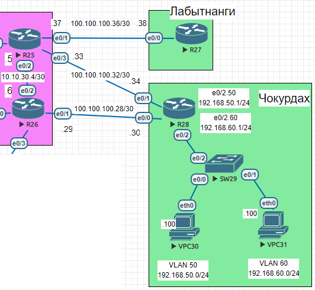
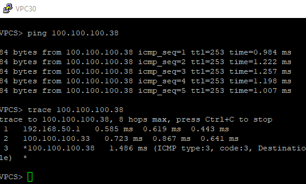
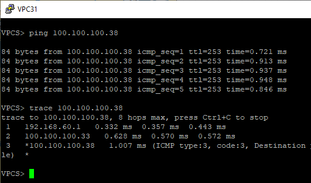
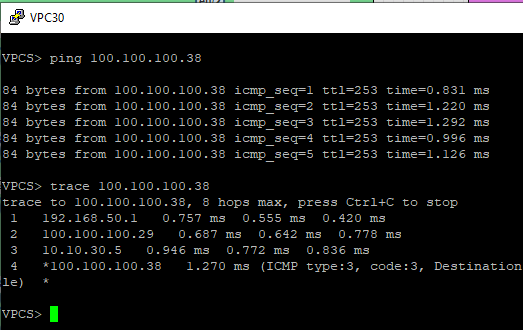
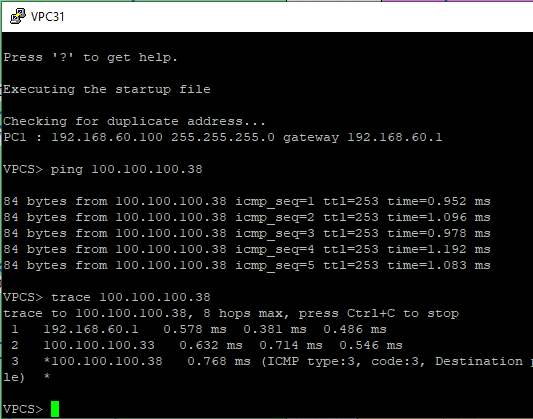

# Маршрутизация на основе политик (PBR)

1. Настроите политику маршрутизации для сетей офиса.
2. Распределите трафик между двумя линками с провайдером.
3. Настроите отслеживание линка через технологию IP SLA.(только для IPv4)
4. Настройте для офиса Лабытнанги маршрут по-умолчанию.

Базовая топология




На роутерах R25, R26, R28 наастроим OSPF. На R27 пропишем маршрут по умолчанию:

```
ip route 0.0.0.0 0.0.0.0 100.100.100.37
```
 После на стройки OSPF и статической маршрутизации на R27 весь трафик с хостов VPC30 и VPC31 идет через R25







## Распределить трафик между двумя линками с провайдером.

Что бы распредилить трафик между двумя линками с провайдером достаточно про делать следующие операции:
к примеру хотим что бы трафик с VPC30 шел через R26

```
Router(config)# access-list 50 permit 192.168.50.0 0.0.0.255
Router(config)# route-map BALANS permit 10
Router(config-route-map)# match ip address 50 - эта команда указывает на то, что трафик будет отфилтровываться на основе ACL номер 50.
Router(config-route-map)# set ip next-hop 100.100.100.29 - эта команда указывает, что для трафика отфилтрованного при помощи ACL номер 50 адресом следующего перехода будет 100.100.100.29
```
Сначала был создан ACL для фильтрации трафика из сети 192.168.50.0 с маской сети 255.255.255.0
Затем мы создали route-map c названием BALANS и порядковым номером 50, а так же действием - разрешить ( permit )


Осталось применить route-map BALANS к интерфейсу e0/2.50

```
ip policy route-map 50
```

Теперь трафик с VPC30 пойдет следующим маршрутом





## Настроить отслеживание линка через технологию IP SLA

Делаем 2 access-list 

```
access-list 50 permit 192.168.50.0 0.0.0.255
access-list 60 permit 192.168.60.0 0.0.0.255
```

Настроим IP SLA для проверки доступности будем использовать icmp-jitter 

```
ip sla 1
 icmp-jitter 100.100.100.33 source-ip 100.100.100.34 num-packets 5
 frequency 5000
ip sla schedule 1 life forever start-time now


ip sla 2
 icmp-jitter 100.100.100.29 source-ip 100.100.100.30 num-packets 5
 frequency 5000
ip sla schedule 2 life forever start-time now
```

После определения операции IP SLA наш следующий шаг - определить объект, который отслеживает SLA. Это можно сделать с помощью IOS Track Object, как показано ниже:

```
track 1 ip sla 1 reachability
track 2 ip sla 2 reachability
```

Организуем PolicyBasedRouting в route-map выставляем приоритет по нашей необходимости.

```
route-map 50 permit 10
 match ip address 50
 set ip next-hop verify-availability 100.100.100.29 10 track 2
 set ip next-hop verify-availability 100.100.100.33 20 track 1

route-map 60 permit 10
 match ip address 60
 set ip next-hop verify-availability 100.100.100.33 10 track 1
 set ip next-hop verify-availability 100.100.100.29 20 track 2
```

Затем применяем rooute-map к сабинтерфейсам роутера R28

```
int e0/2.50
ip policy route-map 50

int e0/2.60
ip policy route-map 60
```

После проделаных манипуляций если оба линка рабочие то трафик ходит следующим образом:





