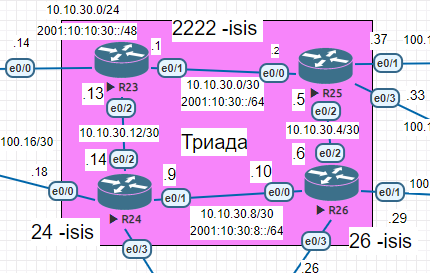
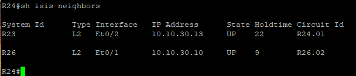
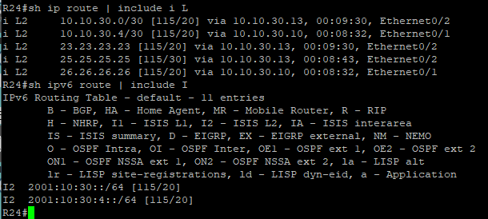
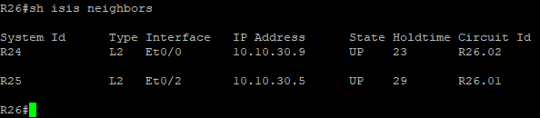
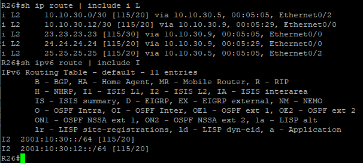
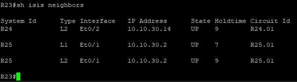
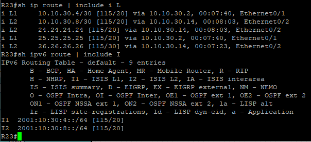
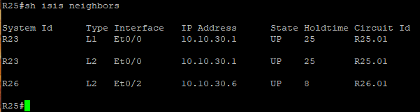

# Настройка IS-IS

Цель:
Настроить IS-IS офисе Триада

Описание/Пошаговая инструкция выполнения домашнего задания:
- Настроите IS-IS в ISP Триада.
- R23 и R25 находятся в зоне 2222.
- R24 находится в зоне 24.
- R26 находится в зоне 26. Настройка осуществляется одновременно для IPv4 и IPv6.


(Конечные конфигурации устройст по результату работы)

[Конфигурационные файлы](configs/)


Базовая топология




Настроим Loopback адреса на роутерах (что бы видеть больше одной сети полученые по isis в таблице маршрутизации, так как почти все роутеры в данной конфигурации имеют конектет сети между собой. Да и Loopback понадобится в последствии при настройке IBGP).

адреса Loopback
- R23 - 23.23.23.23/32
- R24 - 24.24.24.24/32
- R25 - 25.25.25.25/32
- R26 - 26.26.26.26/32


- Запускаем IS-IS 

 ```        
      (config)#router isis
 ```
- Настраиваем net (где первый октет слева будет 49 везде, второй - номер зоны, третий и четвертый - 0, пятый - номер роутера и N Selector - 0)

       R23(config-router)#net 49.2222.0000.0000.0023.00
       R25(config-router)#net 49.2222.0000.0000.0025.00
       R24(config-router)#net 49.0024.0000.0000.0024.00
       R26(config-router)#net 49.0026.0000.0000.0026.00
       
       
- Анонсируем интерфейсы (нужно отдельно сделать для ipv4 и ipv6) 

```
      (config-if)#ip router isis
      (config-if)#ipv6 router isis
 ```


Таблицы соседства и маршрутизации по итогам работы:

















Как видим у R23 и R25 установилось соседство по L1 и L2 типу, так как по умолчанию в Cisco в isis роутеры работают в режиме L1/L2. А R23 и R25 находятся в одной зоне и соединены прямым линком. Здесь можно было для оптимизации на интерфейсах соединяющих R23 и R25 выполнить команду.

```
(config-if) isis circuit-type level-1
```
