# Настройка OSPF

- Настроить OSPF в офисе Москва
- Разделить сеть на зоны
- Настроить фильтрацию между зонами

Описание/Пошаговая инструкция выполнения домашнего задания:
1. Маршрутизаторы R14-R15 находятся в зоне 0 - backbone.
2. Маршрутизаторы R12-R13 находятся в зоне 10. Дополнительно к маршрутам должны получать маршрут по умолчанию.
3. Маршрутизатор R19 находится в зоне 101 и получает только маршрут по умолчанию.
4. Маршрутизатор R20 находится в зоне 102 и получает все маршруты, кроме маршрутов до сетей зоны 101
5. Настройка для IPv6 повторяет логику IPv4.


(Конечные конфигурации устройст по результату работы)

[Конфигурационные файлы](configs/)


Базовая топология

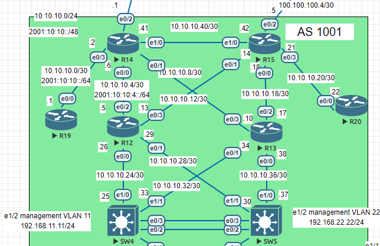

Так как R14 и R15 находятся в зоне 0 то добавил линк между ними R14 e1/0 - R15 e1/0

Настройка OSPF для ipv4 выполним через анонс конект сетей:

```
(config)#router ospf 1
(config-router)#network A.A.A.A B.B.B.B area X
```


Настройка OSPF для ipv6 настроим через интерфейсы
```
(config)#ipv6 router ospf 1
(config-if)#ipv6 ospf 1 area X
```


2. Настроим что бы R12 и R13 получали маршрут по умолчанию.
Это выполняется на ASBR роутерах R14 и R15 в интерфейсе настройки OSPF командой:

```
default-information originate always
```

С параметром always OSPF может анонсировать маршрут по умолчанию независимо от того есть он в таблице маршрутизации или нет.

Таблицы маршрутизации ipv4 R12 и R13 до и после применения выше приведенной команды на ASBR роутерах:

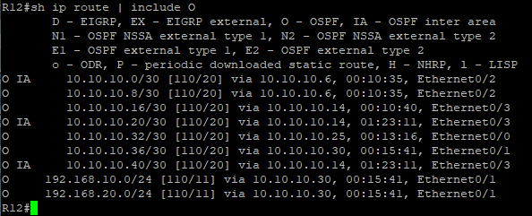

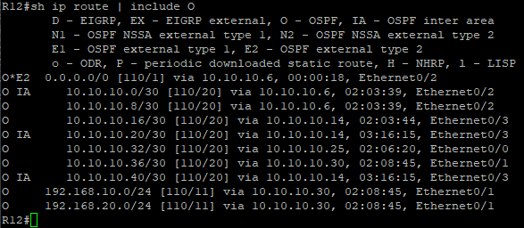

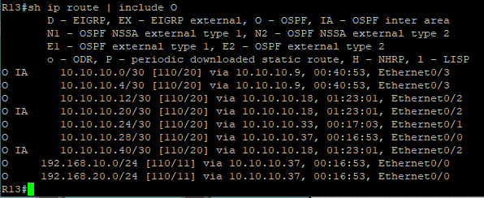

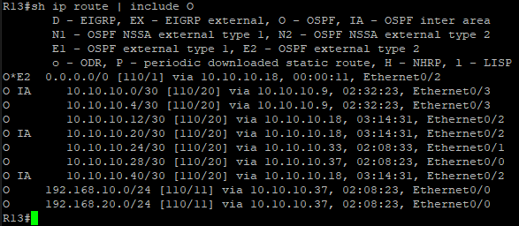

Таблицы маршрутизации ipv6 R12 и R13 до и после применения выше приведенной команды на ASBR роутерах:

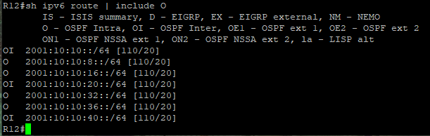

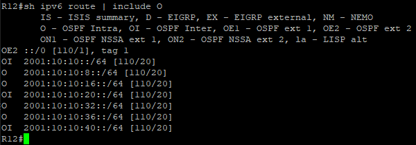

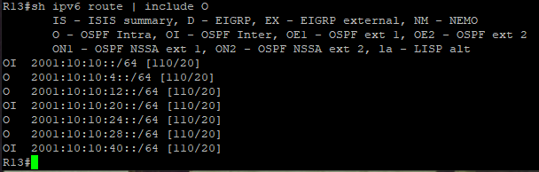

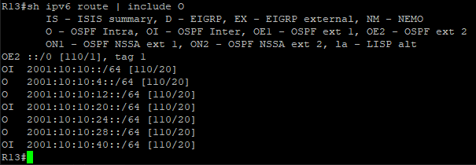


Видим что появился маршрут O*E2 в ipv4 и OE2 в ipv6 это Type 2 external routes (используется по умолчанию для внешних маршрутов)


3. Настроим что бы R19 находящийся в зоне 101 получал только маршрут по умолчанию. Сейчас таблица маршрутизации выглядет так:
(Эта настройка выполнялась до применения на ASBR роутерах команды
default-information originate always, поэтому в скринах отсутствует маршрут OE2)

ip route:
 
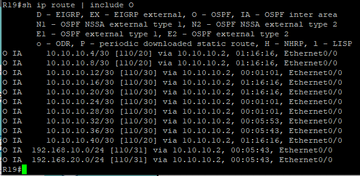

ipv6 route:

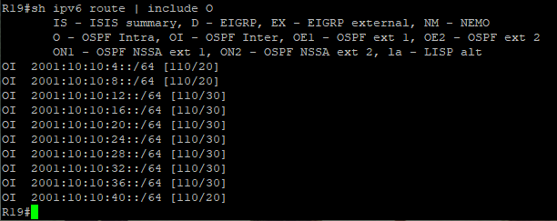


Это выполним при помощи - Totally stubby area. Этот тип области будет блокировать LSA типа 5 и LSA типа 3. 

 
 Настройка выпоняется на R14 в интерфейсе конфигурации OSPF:
 
 ``` 
  are 101 stub no-summary      
 ```
 
 А на маршрутизаторе R19:

 ```
 area 101 stub
 ```
          
 После введенных настроек таблица маршрутизации на R19 выглядит: 

 ip route:

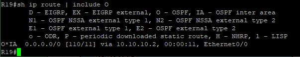

ipv6 route:

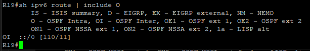


 4. Настроим что бы маршрутизатор R20 находящийся в зоне 102 получал все маршруты, кроме маршрутов до сетей зоны 101

Таблица маршрутизации на R20

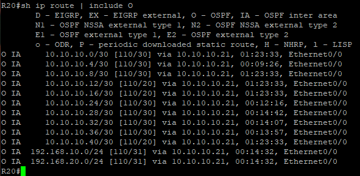

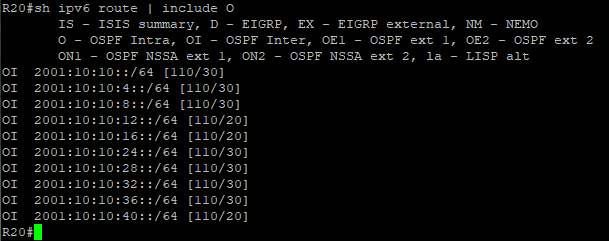

OSPF поддерживает фильтрацию маршрутов, но она возможна только на пограничных роутерах, которые называются ABR (Area Border Router) и ASBR (Autonomous System Boundary Router). Причиной этому является логика анонсирования маршрутов в протоколе OSPF. LSA третьего типа создаются пограничными роутерами, которые подключены к магистральной области (backbone area) и минимум одной немагистральной. Type 3 LSA также называются Summary LSA. С помощью данного типа LSA ABR анонсирует сети из одной области в другую. В таблице базы данных OSPF они отображается как Summary Net Link States.
Фильтрация LSA третьего типа говорит маршрутизатору не анонсировать сети из одной области в другую, тем самым закрывая доступ к сетям, которые не должны отображаться в других областях.


Для настройки фильтрации применяется команда в интерфейсе конфигурации OSPF.
```
 area area-num filter-list prefix prefix-list-name {in | out}
```


   Здесь применяются списки префиксов или prefix-list, Маршрут не анонсируется если попадает под действие deny в списке префиксов.
Камнем преткновения в данной команде являются ключевые слова in и out. Эти параметры определяют направление фильтрации в зависимости от номера области, указанного в команде area are-num filter. А работают они следующим образом:
Если прописано слово in, то маршрутизатор предотвращает попадание указанных сетей в область, номер которого указан в команде.
Если прописано слово out, то маршрутизатор фильтрует номера сетей, исходящих из области, номер которого указан в команде.


На R15 создаем prefix-list

ipv4

``` 
    ip prefix-list FILTER-FROM-AREA-101 seq 5 deny 10.10.10.0/30
    ip prefix-list FILTER-FROM-AREA-101 seq 10 permit 0.0.0.0/0 le 32
 ```

 ipv6
```
ipv6 prefix-list FILTER-FROM-IPV6-AREA-101 seq 5 deny 2001:10:10::/64
ipv6 prefix-list FILTER-FROM-IPV6-AREA-101 seq 10 permit 0::/0         
```

 Затем в конфигурации настройки OSPF:
 
 ipv4

 ```
    area 102 filter-list prefix FILTER-FROM-AREA-101 in - для IPv4
```    
 ipv6

```
distribute-list prefix-list FILTER-FROM-IPV6-AREA-101 in
```
    
 Таблица маршрутизации на R20 после проделанных манипуляций:


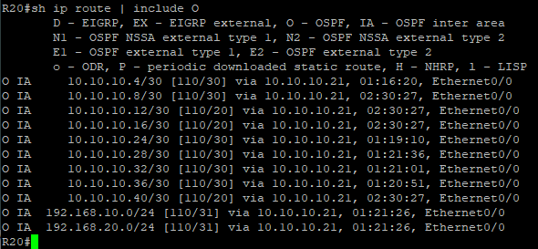

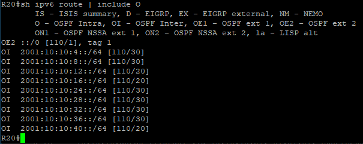

как видим маршрут сети 10.10.10.0/30 и 2001:10:10::/64 пропал.