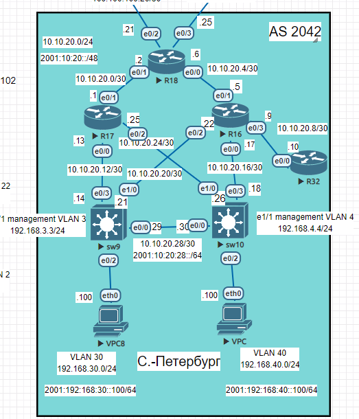
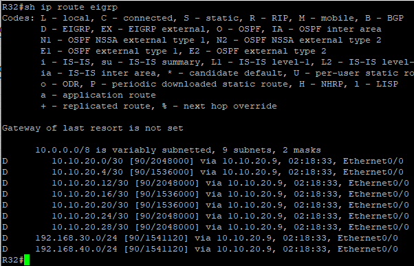
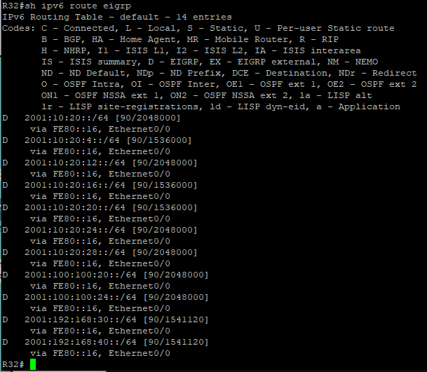
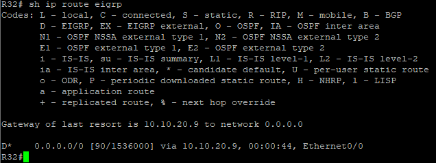
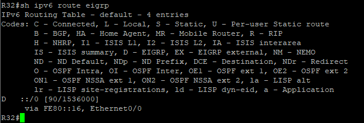
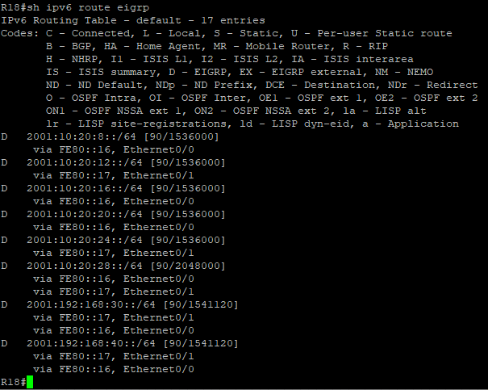
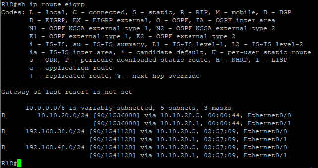
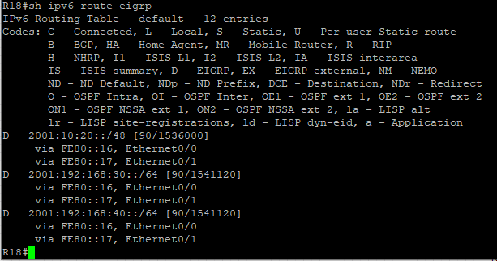

# Настройка EIGRP

Цель:
- Настроить EIGRP в С.-Петербург;
- Использовать named EIGRP

Описание/Пошаговая инструкция выполнения домашнего задания:

1. В офисе С.-Петербург настроить EIGRP.
2. R32 получает только маршрут по умолчанию.
3. R16-17 анонсируют только суммарные префиксы.
4. Использовать EIGRP named-mode для настройки сети.
 Настройка осуществляется одновременно для IPv4 и IPv6. 


(Конечные конфигурации устройст по результату работы)

[Конфигурационные файлы](configs/)


Базовая топология


      


## 1.Настроим EIGP named-mode.

 В отличии от традиционного метода, при настройке этого режима на маршрутизаторе экземпляр EIGRP не создается и не запускается:

```
(config)#router eigrp S-PIT
```
Экземпляр будет создан при настройке адресного семейства и номера автономной системы.
для ipv4
```
(config-router)#address-family ipv4 unicast autonomous-system 1
```
для ipv6
```
(config-router)#address-family ipv6 unicast autonomous-system 1
```
В этом именованном режиме необходимо создать только один экземпляр EIGRP. Одна вещь, о которой следует знать в отношении именованного режима, заключается в том, что конфигурация адресного семейства не включает маршрутизацию IPv4, как традиционная конфигурация IPv4 EIGRP. Для запуска процесса требуется 'no shut':

Именованный EIGRP имеет три режима, в которых выполняется основная часть конфигурации. Это:

- режим конфигурации адресного семейства - `(config-router-af)#`

- режим конфигурации интерфейса адресного семейства -`(config-router-af-interface)#`

- режим конфигурации топологии адресного семейства - `(config-router-af-topology)#`.

В режиме конфигурации адресного семейства добавим все интерфейсы к анонсу.
```
(config-router-af)#network 0.0.0.0
```
Перейдем в режим конфигурации интерфейса адресного семейства и отключим все интерфейсы из EIGRP:
```
(config-router-af)#af-interface default
(config-router-af-interface)#shutdown
```
А затем заходя на каждый необходимый интерфейс включаем их
```
(config-router-af)#af-interface e x/y
(config-router-af-interface)#no shutdown
```
После всех настроек таблица маршрутизации на R32:





## 2.Настройка маршрута по умолчанию в протоколе EIGRP


В протоколе EIGRP нет возможности настроить распространение маршрута по умолчанию 0.0.0.0 0.0.0.0, как это реализовано в другиз протоколах при помощи команды `default-information originate`.
Это можно сделать при помощи настройки суммарного маршрута 0.0.0.0 0.0.0.0 на интерфейсе маршрутизатора, который должен распространять маршрут по умолчанию. Данный способ распространения маршрута по умолчанию появился в ОС IOS с версии 12.0(4)Т. 
Выполним на интерфейсе e0/3 маршрутизатора R16 в меню af-interface (Ввод конфигурации интерфейса семейства адресов):

для ipv4
```
(config-router-af-interface)#summary-address 0.0.0.0 0.0.0.0
```
для ipv6
```
(config-router-af-interface)#summary-address ::/0
```
Сейчас таблица маршпутизации на R32 выглядет так:





Распространение маршрута по умолчанию в виде суммарного маршрута имеет две особенности. Первая из них заключается в том, что метрика для такого маршрута но умолчанию назначается в соответствии с правилами назначения метрики суммарным маршрутам. Второй особенностью является то, что через интерфейс, по которому распространяется суммарный маршрут 0.0.0.0/0, не будут распространяться никакие другие маршруты протокола EIGRP.

## 3. Настроить что бы R16-17 анонсировали только суммарные префиксы.


Для этой задачи выполним теже самые команды который выполняли при настройке маршрута по умолчанию, только будем указывать не все нули а суммарные маршруты, который выбрали на этапе проектирования сети. А именно:
- `для ipv4 10.10.20.0/24`
- `для ipv6 2001:10:20::/48`

настройку выполняем на интерфейсах e0/1 роутеров R16-R17 смотрящих на R18.
для ipv4
```
(config-router-af)#af-interface e0/1
(config-router-af-interface)#summary-address 10.10.20.0 255.255.255.0
```
для ipv6
```
(config-router-af)#af-interface e0/1
(config-router-af-interface)#summary-address 2001:10:20::/48
```
Таблицы маршрутизации на R18 до настройки:




после настройки:







