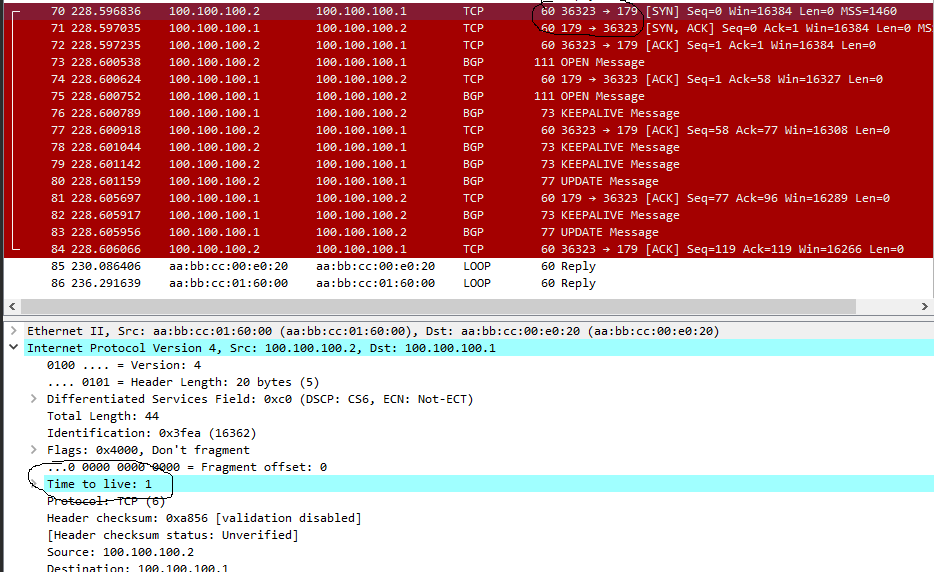
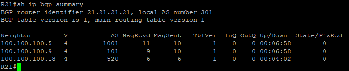
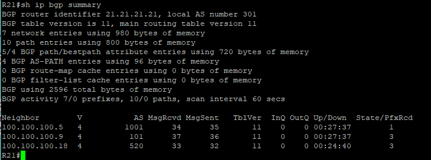
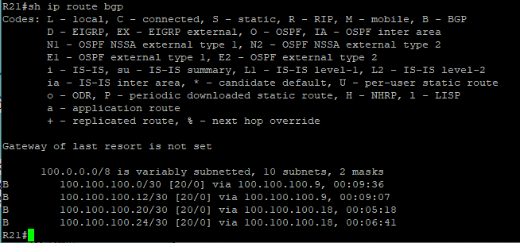
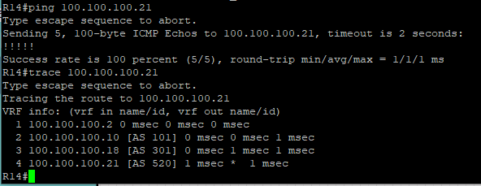

# BGP. Основы

Цель:
Настроить BGP между автономными системами
Организовать доступность между офисами Москва и С.-Петербург

1. Настроите eBGP между офисом Москва и двумя провайдерами - Киторн и Ламас.
2. Настроите eBGP между провайдерами Киторн и Ламас.
3. Настроите eBGP между Ламас и Триада.
4. Настроите eBGP между офисом С.-Петербург и провайдером Триада.
5. Организуете IP доступность между пограничным роутерами офисами Москва и С.-Петербург.

(Конечные конфигурации устройст по результату работы)

[Конфигурационные файлы](configs/)


Базовая топология


      
Сначала мы запускаем BGP процесс и указываем номер AS
```
(config)#router bgp local_as_number
```
Задаем роутер id

```
(config-router)#bgp router-id x.x.x.x (x - номер роутера)
```

Теперь поднимаем пиринг.
```
(config-router)#neighbor ip-_of_neighbor remote-as remote_as_number
```
Командой neighbor мы указываем, с кем устанавливать сессию. Именно на адрес `ip-_of_neighbor` маршрутизатор будет отсылать сначала TCP-SYN, а потом OPEN. Также мы обязаны указать номер удалённой Автономной Системы – `remote_as_number`

Конфигурация с обратной стороны симметрична:

BGP-ПИРИНГ

Учитывая, что BGP является протоколом маршрутизации AS-to-AS, вполне логично, что внешний BGP (т.е. eBGP) является ключевым компонентом в его операциях. Самое первое, что нам нужно учитывать при работе с eBGP, - это то, что стандарты построены таким образом, что требуется прямое подключение. Поскольку предполагается прямое соединение, протокол BGP выполняет две вещи:

- Будет проверять значение времени жизни (TTL), и что значение time-to-live установлено в 1. Это означает прямую связь между одноранговыми узлами EBGP.
- Осуществляется проверка, что два устройства находятся в одной подсети.

Еще один важный момент рассмотрения пирингов eBGP - это TCP-порты, которые будут использоваться. Это особенно важно для конфигураций брандмауэров, которые защищают автономные системы. Первый спикер BGP, который инициирует изменения состояния, приходящие по мере формирования соседства, будет получать трафик из случайного TCP-порта, а конечным портом будет TCP-порт 179. Отвечающий спикер BGP будет получать трафик с TCP-порта 179, а порт назначения будет случайным портом. Брандмауэры должны быть перенастроены с учетом изменений в коммуникации. На основе этих изменений спикер BGP инициирует сеанс, и это, вносит изменения для будущего сеанса.

Это мы можем увидеть в анализе дампа TCP с помощью Wireshark порта e0/2 роутера R14 в процессе установления eBGP соседства c роутером R22



Как видим установились соседста по bgp на примере R21:



но State/PfxRcd стоят нули, нужно анонсировать сети:

```
(config-router)#network x.x.x.x mask y.y.y.y
```
Сейчас на R21:



в столбце State/PfxRcd появились числа.

таблица маршрутизации на R21:



## Организовать IP доступность между пограничным роутерами офисами Москва и С.-Петербург.

Пинг и трассировка в R14 (пограничный роутер офис Москва) на R18 (пограничный роутер офис С-Питербург)




